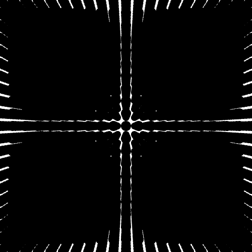
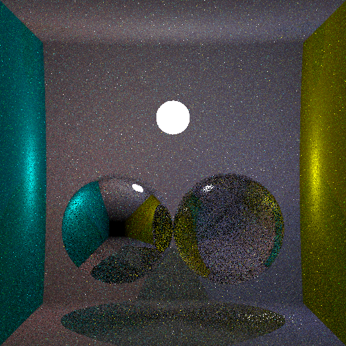
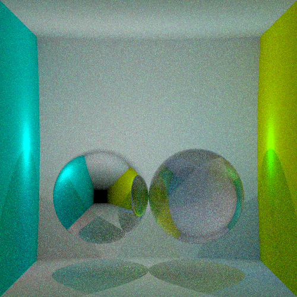
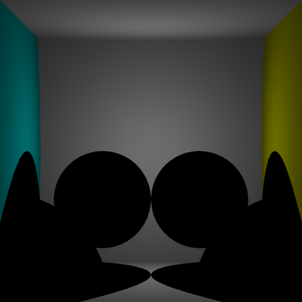
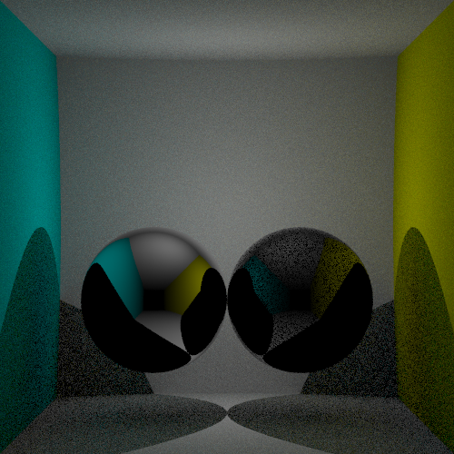
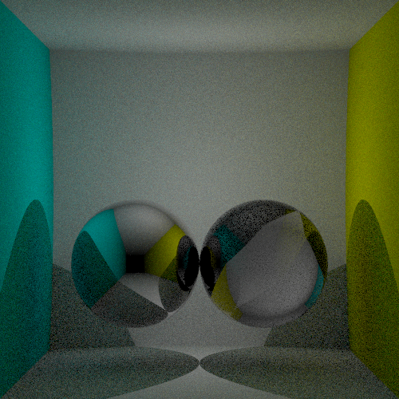
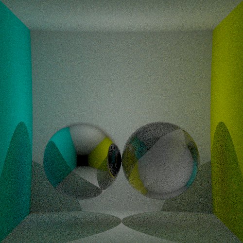
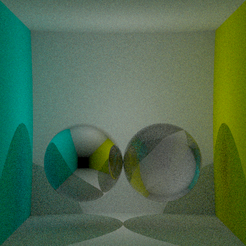
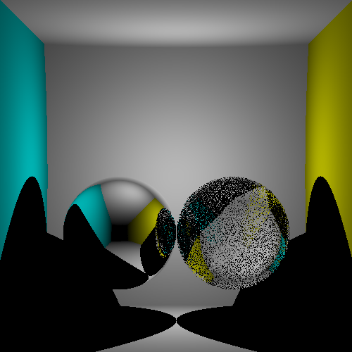
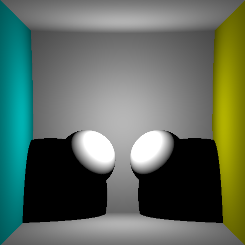

StreamRay is a raytracing engine written live on twitch.

You can follow it on https://www.twitch.tv/FlyingGuibou

Stream will be copied to Youtube regularly.

Stream #8
=========

Support for a high number of primitives (still spheres).

We added a `Box` primitive, as well as a `BHV` object, which split the scene in
a tree. Walking this tree is more efficient than a linear search for
intersection.

This approach proved its benefits, but we really need to improve the
implementation efficiency during next stream.

This scene, composed of 9261 spheres is rendered in 20s. In comparison, a scene
with 25 spheres was rendered in 10s without the acceleration structure.

Stream #7
=========

- We worked a bit on performance again, reduced the random generator overhead
  by threading the random generator through the function calls. This removes
  the concurrent access on the global RNG which is sync and hence slow.
- We added `async` and multi core rendering.
- We extended the `Light` data type to include sphere light, which are now
  extracted from the sphere objects with an emission behavior.

Stream #6
=========

We mostly did optimisation which cut the rendering time from 27s to 4s. Using
profiling we where able to locate and fix the following performances probleme:

- The `random` library is slow. We upgraded to random 1.2.0 for a huge
  performance boost.
- Using `linear` `V3` leads to packed data (because it is polymorphic). We
  replaced it by our own implementation which correctly unpack.
- A few `INLINE` improved the allocations.
- Rewriting `rayIntersectObjects` from a series of `map` and `maximum` to a
  `foldl'` gives a huge performance boost.

We also refactored the direct lighting and introduced a `Scene` and `Light`
datastructure, in order to handle multiples lights. Light selection is done
randomly, a light is picked uniformly. This leads to introduced noise.

The following image is generated with 200 samples per pixel in ~150s on my laptop

Stream #5
=========

- We introduced pixel filtering (with a box filter) in order to get anti aliasing.
- Indirect lighting for diffuses surfaces using cosinus weighted importance sampling.
- Russian rulette for earlier termination of the render.

The following images are computed with different maximum depth.

Stream #4
=========

We added `reflect` and `refract` function in order to handle mirror and glass
material.

Glass are not trivial because they involves the combination of both behaviors.
During the stream we first decided to trace both the reflected and refracted
rays, which was super slow.

Instead we used sampling by randomly picking one or the other and weighting it
with the probability density. We then decided to use multiple importance
sampling in order to reduce the noise.

Stream #3
=========

In this short stream, we added shadows by tracing a ray toward the light and
check if there is any object in the path. We observed that it was leading to
noise on the surface because the point on the surface may sometime be under the
surfaces. We addressed this issue by slightly moving the ray origin toward the
light source, in order to exit the current object.

Stream #2
=========

In this 1:30 stream, we were able to make many changes.

- We fixed the black ring bug around spheres and introduced a `tonemap`
  function, responsible to scale float measurements to screen value.
- We extended the scene so it looks like a cornel box, with walls defined using big spheres
- We introduced a `Material` type, now associated with the `Sphere` using the `Object` type.
- We introduced a lighting model for the material, taking into account a light
  position, the distance to the light, the angle between the ligth direction
  and the surface normal.
- We extended the camera model to a perspective, using a secondary bigger projection plane.
- Basic gamma correction.

Stream #1
=========

This is the first stream, we computed a depth buffer of a scene composed of many (2) spheres.

