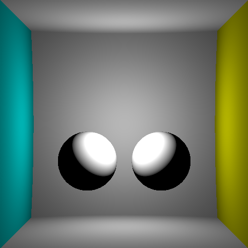
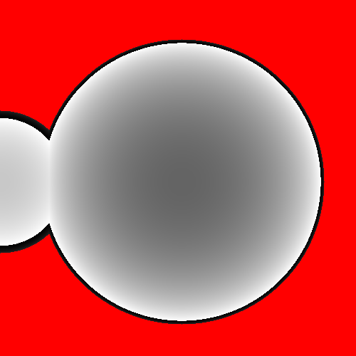

StreamRay is a raytracing engine written live on twitch.

You can follow it on https://www.twitch.tv/FlyingGuibou

Stream will be copied to Youtube regularly.

Stream #3
=========

In this short stream, we added shadows by tracing a ray toward the light and
check if there is any object in the path. We observed that it was leading to
noise on the surface because the point on the surface may sometime be under the
surfaces. We addressed this issue by slightly moving the ray origin toward the
light source, in order to exit the current object.

Stream #2
=========

In this 1:30 stream, we were able to make many changes.

- We fixed the black ring bug around spheres and introduced a `tonemap`
  function, responsible to scale float measurements to screen value.
- We extended the scene so it looks like a cornel box, with walls defined using big spheres
- We introduced a `Material` type, now associated with the `Sphere` using the `Object` type.
- We introduced a lighting model for the material, taking into account a light
  position, the distance to the light, the angle between the ligth direction
  and the surface normal.
- We extended the camera model to a perspective, using a secondary bigger projection plane.
- Basic gamma correction.

Stream #1
=========

This is the first stream, we computed a depth buffer of a scene composed of many (2) spheres.

